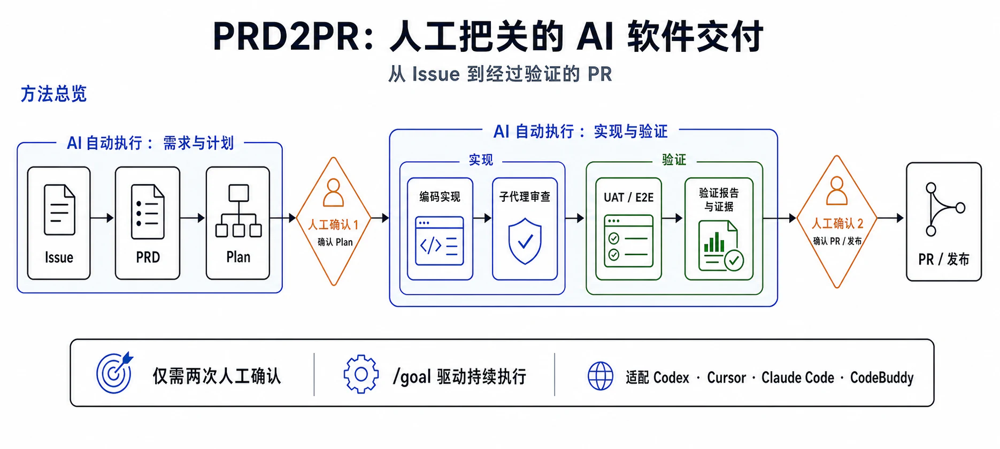
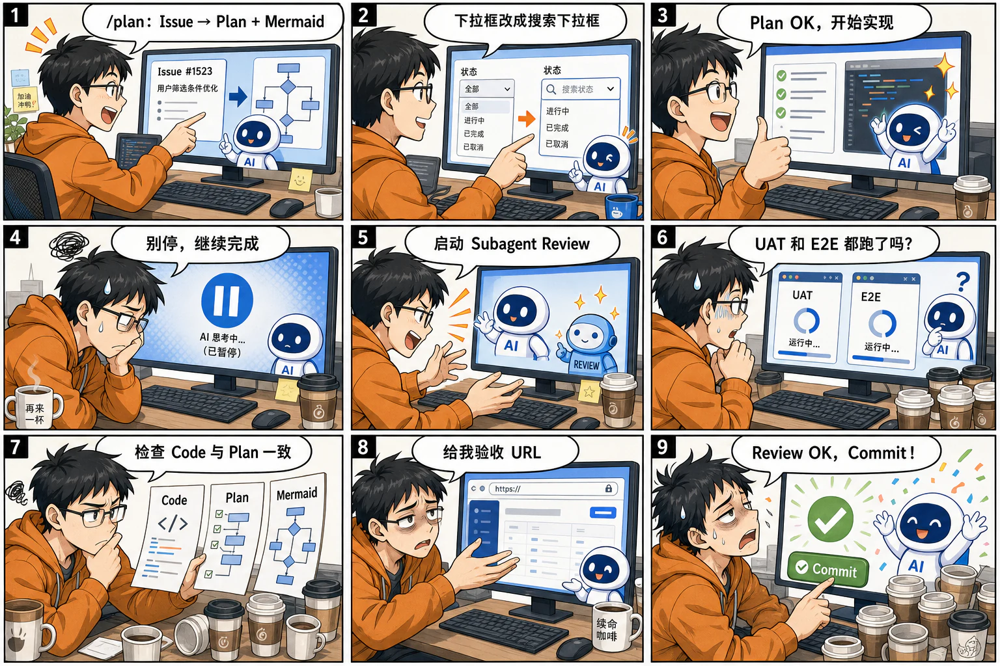
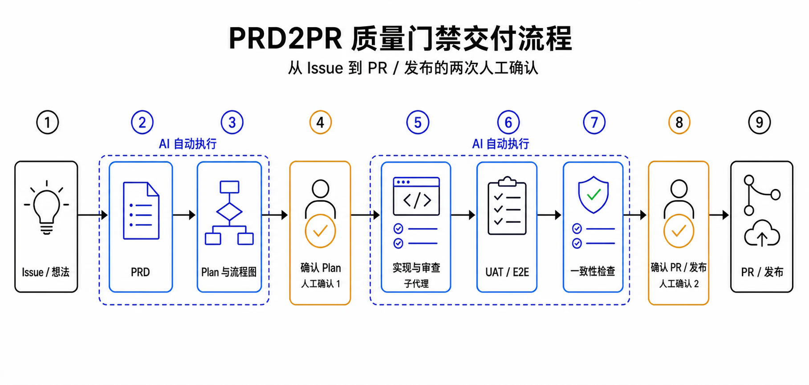
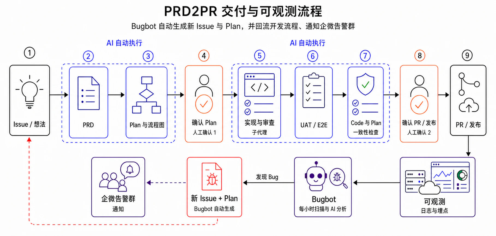
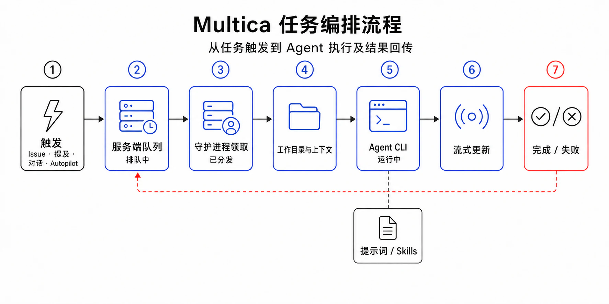
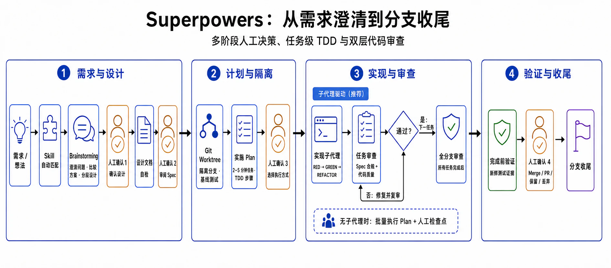

[poipoi-agent](https://github.com/lasywolf/Learn-OpenClaw)
# 比 Multica 更好用的开箱即用 PRD2PR Skill



> prd2pr skill 在页面最下面。目前我自己每天都在用这个 skill，感觉自己飞升了：vibe coding 由两并发升为四并发，且下班时不再精疲力尽。

## 什么是 prd2pr？

什么是 prd2pr？就是 prd to pr，从需求文档到代码合并。为什么我要做 prd2pr 呢？因为之前 vibe coding 我只能两并发并且每天精疲力尽，我想要四并发且没这么累。当然最主要的直接原因是我电脑 MacBook 装 Multica 需要 Docker 虚拟机会变得很卡，也不清楚 Multica 它内部到底做了哪些东西来保证代码质量（除非我翻源码），以及 Multica 的前端界面 task、issue 流转管理和多人协作功能对我来说用不上。

但是我又非常需要 prd2pr，又不想限定死在某个平台用，同时又要满足轻量化、方便用、效果好的特点。因为如果 prd2pr 足够简单到让小白直接开箱即用，并且能直接在 Cursor、Codex、CodeBuddy 等直接使用，那就太棒了！所以最近我当今开源的 prd2pr 工具（Multica 和 Superpowers）后，我悟了，其实 prd2pr 不需要这么复杂，于是自己写了一套 prd2pr skill，简单但非常好用，我每天都在用。

## prd2pr 是怎么来的？

在正式介绍 prd2pr 之前，我得讲讲它的由来是怎样的。我们先想想，我们都是怎么和 AI 进行多次对话 vibe coding 的。例如首先我们接到一个需求，我们会先跟 AI 说：

```text
"/plan 你帮我把下面这个 issue 转成 plan，并且带有 Mermaid：写一个好看的前端"
"你这个 plan 的下拉框细节不太对，你改成搜索下拉框"
"这个 plan 没问题，你开始实现吧"
"你怎么停下来了？你这个 plan 实现完了吗？没有的话就继续"
"你起一个 subagent 来进行 /review"
"你的测试都跑完了吗？有没有跑 UAT 和 E2E 测试？"
"你去确认一下实现的代码与 plan、Mermaid 是否一致，看看有哪些漏的"
"你给我一个 case 的 URL，让我看看、验收一下"
"可以了，我 review 完了，你去 commit 吧"
```



如果按照 todolist 来看，也就是：

```text
prd2pr TODO
- [ ] Issue -> PRD
- [ ] PRD -> Plan
- [ ] Stop: 人工确认计划并调整
- [ ] 实现 + subagent review
- [ ] UAT + E2E 测试
- [ ] 确认与计划、Mermaid 一致
- [ ] Stop: MR/PR 或发布前人工确认
```

那么这个就是需求开发流程的生命周期。几乎每个人 vibe coding 的流程都长这样，并且每天打字发给 AI 的 prompt 都高度相似，例如“`/plan` 这是我的需求，你帮我 plan”、“你找个 subagent 来 `/review` 下吧”等等，只是项目细节有些不同，这就是我们日常 vibe coding 的开发流程。

如果我们将这里面的绝大部分步骤用 AI 来自动跑，而人类只需要做好 review plan detail 和 code review 就够了，恭喜你发明了 prd2pr。如果我们把这个流程 todolist 写成 skill，并且使用 `/goal` 强制要求 AI 来执行 todolist，恭喜你发明了 prd2pr skill，如下图。（如果想要了解 `/goal` 是什么，可以问一下 ai）



## 如何保证代码质量？

最经常被问的一个问题就是：“你如何保证代码的质量？”这里有三个时机来保证代码质量：

1. AI 生成 plan 的时候，你来 review 这个 plan 的细节；

2. AI 实现完并且测试后，你来 review 这个实现的效果，并且让 AI 提供 case（后端提供 curl，或者前端提供 URL 网页）；

3. 上线后，通过日志和埋点实现可观测。这里我们会做一个 bugbot，每过一小时就扫描日志，看看有什么报错，并且由 AI 自动分析，再把结果发到企业微信告警群。如果有 bug，就生成一个 issue，并给出相关的 plan。

这个时候就有细心的同学发现了，开发流程已经有了完整的闭环：从 issue 到开发、测试、合代码、上线、可观测发现 issue，再回到开发。后面会再写一篇文章详细介绍 bugbot（当然 KM 已经有很多介绍巡检机器人的实践）。



### 这不还是需要人来 review 吗？

另外 AI 写的 `plan.md` 看不懂怎么办？其实一般来说，先看这里面的 Mermaid 就很够了，然后再 review 一下代码，看看有没有改动到核心代码，并确定影响面。

## prd2pr 真的有用吗？

是真的有用的。这个 skill 虽然是非常简单的 prompt，但令人震惊的是，这样简单的 prompt 工程在今天的 vibe coding 中依旧有很好的效果。另外值得一提的是，grill me 也是非常简单的 prompt skill，但也因为实际很好用而出名。

如果你直接跟 AI 说“帮我写好看的前端管理界面”，AI 是不会主动写 plan、画 Mermaid 图找你验证，不会主动找 subagent 来 review，也不会主动写 E2E 测试和发布到测试环境中验证。最终让 AI 写前端的时候，跑很久、消耗大量 token，却得到一版样式错乱、图标重叠、AI 味浓等等问题的前端界面。解决方法很简单，依旧是 prompt 工程。例如，[Impeccable](https://github.com/pbakaus/impeccable) 这个 skill 就是为了专门处理这类问题的。

## 使用 prd2pr skill 有什么效果？

- **提升效率**：之前可能只能两并发 vibe coding，现在能够做到四五并发。

- **减少精力消耗和打字数**：原本开发流程的 7 步全部需要人类手打相同的 prompt 和 AI 交互，现在只有 2 步。

- **开箱即用**：不管你用 Codex、Claude Code、CodeBuddy 还是 Cursor，直接就能使用。

- **更轻量、更易适配各种项目**：并且我认为，每个人的项目定制化适配 prd2pr 后效果会更好。

## skill 内部细节设计

包含八个步骤，这真的很简单，不要跳过。当然，也能直接看页面最底下的 `SKILL.md` 原文。

1. **Issue -> PRD**：AI 根据用户的 issue 设置 `/goal` 并开始，并且要求 AI 写一份 PRD。

2. **PRD -> Plan**：要求 AI 使用 Codex、Cursor、CodeBuddy 自带的 `/plan` 工具，生成包含 Mermaid 的 `plan.md`。

3. **Stop，直到 Human Review Plan 没问题**：要求 AI 提供 `prd.md`、`plan.md`，以及将 `/goal` 设置为 block。当 Human 确认没问题后，AI 再将 `/goal` 设置为 resume。

4. **Implement + subagent review**：让 AI 开始干活，并且在实现完后让 subagent 调用 `/review` 工具，发现问题后由 AI 进行修复。

5. **UAT 测试**：除了后端的单元测试、集成测试外，让 AI 自己到测试环境中进行 E2E 测试。

6. **Code 与 plan 一致性检查**：让 AI 检查 code 的实现与之前写的 plan 是否一致。

7. **Stop，直到 Human Review 没问题**：要求 AI 提供包含 Mermaid 的 `final_report.md`，以及将 `/goal` 设置为 block。当 Human 确认没问题后，AI 再将 `/goal` 设置为 resume。

8. **Commit、push 和 MR**：Human 确认没问题后，让 AI 来 commit、push，以及提供工蜂 MR 的 URL，最后 AI 设置 `/goal` 为 finish。

### prd2pr TODO

```text
prd2pr TODO
- [ ] Issue -> PRD
- [ ] PRD -> Plan
- [ ] Stop: 人工确认计划并调整
- [ ] 实现 + subagent review
- [ ] UAT + E2E 测试
- [ ] 确认与计划、Mermaid 一致
- [ ] Stop: MR/PR 或发布前人工确认
```

## 如何使用？

1. 略读一遍这个 `SKILL.md`，了解整个 prd2pr 流程后，才能更好地使用 skill。

2. 安装 skill。

3. 在 Cursor、CodeBuddy 或 Codex CLI 里面输入：`/prd2pr [你的需求]`。

4. 在“Stop: 人工确认计划并调整”这个阶段，AI 找你确认；你确认完后回复“OK”。

5. 在“Stop: MR/PR 或发布前人工确认”这个阶段，AI 找你确认；你确认完后回复“OK”。

6. 恭喜你，你使用 prd2pr 完成了一个需求！

## 未来可优化的方向

- 加入 grill me 的功能，在生成 Plan 的时候附带几个重点确认的内容，让 Human 确认。

- Human review 的时候，优化 prompt，让 AI 给的 `report.md` 更加易懂。

## 竞品对比：Multica 和 Superpowers

### Multica

Multica 开头已经提到过了，有以下难用的点：

1. MacBook 上不方便自己部署使用，因为需要在 MacBook 上使用 Docker 部署且占用大量内存，导致日常使用卡顿。

2. Multica 的前端界面、task、issue 流转管理和多人协作功能，对于个人开发来说用不上，显得多余了。

3. 不能开箱即用，得要注册登录且只能通过网页交互，而不是像之前一样在 VS Code 之类的 IDE 中交互。



### Superpowers

我们再来看下图 Superpowers 怎么写 todolist。这挺好的，能提升代码质量，但这里有两个问题：

1. 它太过于重量级了。如果我们想要 AI 做一个小的字段改动，还是要走这么复杂的流程，简单来说就是太消耗 token 了！

2. 它不方便自己定制化，流程已经固定下来了。并且我相信，使用 Superpowers 的 99% 的人不会选择拉下代码后，自己修改流程以适配自己的项目。



## 其他

- 因为经常有同学问我 agent 怎么学，所以今年过年期间我写了个《一天 9 小时学完 Agent》的教程，现在还没过时，目前有 465 star，欢迎阅读：[Learn-Openclaw](https://github.com/lasywolf/Learn-Openclaw)。

## SKILL.md 原文

````markdown
---
name: prd2pr
description: >-
  驱动一个 issue 或产品想法完成从 AI 撰写 PRD、AI 生成实现计划、人工确认、
  实现、子代理审查、UAT/E2E 验证、计划与 Mermaid 一致性检查，到 MR/PR
  或发布就绪的全流程。当用户提到 prd2pr、issue 到 PRD、PRD 到计划、
  目标驱动交付、实现 TODO 清单、人工确认关卡，或要把一个需求从 issue
  推进到 PR/MR/发布时使用。
disable-model-invocation: true
---
# prd2pr

按显式 TODO 清单和强制人工确认关卡，跑完整个 issue 到 PR 的工作流。

## 启动

如果执行环境是 Codex、PI 或 Claude Code 且有 goal 工具可用，创建一个 goal，其 objective 覆盖整个 prd2pr TODO 清单。这个 goal 不只是做计划，而是要覆盖所有可自动执行的步骤，直到遇到强制 `Stop` 关卡为止。

goal 被暂停（blocked/paused）后不会自动恢复，必须显式调用 goal 工具把状态改回可执行状态。每次人工确认通过后，第一件事就是调用 goal 工具恢复 goal，然后才继续后续步骤；不要只是在对话里说"继续"而不实际操作 goal 状态。

在对话中创建并维护这份清单：

```markdown
prd2pr TODO
- [ ] Issue -> PRD
- [ ] PRD -> Plan
- [ ] Stop: 人工确认计划
- [ ] 实现 + 子代理审查
- [ ] UAT + E2E 测试
- [ ] 确认与计划、Mermaid 一致
- [ ] Stop: MR/PR 或发布前人工确认
```

随进展更新清单。只有产出物就位并检查过后，才把某一步标记为完成。

## 产物输出

始终把 PRD、计划、审查总结、验证结果、最终报告写入文件。Mermaid 图直接放进 `plan.md` 里，不要单独建 Mermaid 文件。在每个 `Stop` 关卡，不要把完整产物贴进终端或聊天，只给出文件路径和简明摘要，方便用户自己打开查看。

展示文件路径时，标签和路径之间要有一个空格，不要用冒号紧贴着路径，这样终端才能把路径识别成可点击链接。例如 `- PRD： .prd2pr/hide-ai-group-button/prd.md`，而不是 `- PRD：.prd2pr/hide-ai-group-button/prd.md`。

除非用户明确要求把这些产物纳入版本管理，否则默认使用：

```text
.prd2pr/<short-task-name>/prd.md
.prd2pr/<short-task-name>/plan.md
.prd2pr/<short-task-name>/final-report.md
```

在 Git 仓库中，创建产物前先确认 `.prd2pr/` 没有已跟踪文件，再把根目录规则 `/.prd2pr/` 追加到 `git rev-parse --git-path info/exclude` 返回的仓库本地 exclude 文件中；规则已存在时不要重复追加。不要为此修改项目 `.gitignore` 或全局 Git ignore。写入产物前用 `git check-ignore` 确认目标路径已被忽略；如果 `.prd2pr/` 已被跟踪、存在用途冲突或无法安全设置本地 ignore，优先使用仓库已有且已忽略的本地产物目录，否则向用户确认替代位置。

至少要在每次人工确认前创建或更新相应文件。每个 `Stop` 和提交前都检查 `git status --short`，确保这些产物没有进入工作区变更。用户明确要求审查或纳入版本管理时，把选定产物复制到仓库约定的正式目录，不要强制添加被忽略的 `.prd2pr/`。

## 1. Issue -> PRD

直接分析 issue 或用户需求，不要为这一步调用别的 skill。产出的 PRD 需包含：

- 问题陈述
- 背景与当前痛点
- 目标
- 非目标
- 目标用户或受影响的工作流
- 需求
- 验收标准
- 风险、依赖与假设

如果 issue 有歧义，做出最小、合理的假设并明确标注出来。只有当缺失信息会让计划不安全或很可能出错时，才向用户提问。

## 2. PRD -> Plan

直接基于 PRD 生成实现计划，不要依赖 `/plan`。计划需包含：

- 任务拆分
- 可能受影响的文件、模块或系统
- 数据、API、迁移或兼容性方面的考量
- 测试策略
- UAT 和 E2E 策略，包括本地启动哪些服务、如何确认服务已就绪
- 风险与回滚方案

同时产出一张 Mermaid 图，表示实现流程或任务依赖关系。

## 3. Stop: 人工确认计划

暂停当前 goal，在开始实现前停下来，向用户展示 PRD、计划和 Mermaid 图供人工审查。

如果用户反馈了问题：

1. 修订 PRD、计划或 Mermaid 图。
2. 展示修订后的版本。
3. 再次暂停，等待人工确认。

重复以上过程，直到用户明确确认。确认前不要进入实现阶段。确认后，立即调用 goal 工具把 goal 状态从 blocked/paused 恢复为可执行，再继续下一步。

## 4. 实现 + 子代理审查

只实现已确认的计划。如果实现过程中发现计划有错或不完整，更新计划和 Mermaid 图，并回到"Stop: 人工确认计划"重新走一遍确认。

实现完成后，按三个审查 skill 的规则执行审查：

- `review`：需要用户选择审查类型时使用。
- `review-bugbot`：运行 Bugbot 风格的代码正确性审查。
- `review-security`：当涉及安全敏感代码、鉴权、权限、数据处理、外部输入、密钥或网络边界时，运行 Security Review。

如果当前环境能直接运行这些 skill 或子代理，就直接用。如果不能，在当前会话里按它们的规则做等效审查，并告知用户直接调用 skill/子代理不可用。

自行评估审查发现：

- 修复确认为真实问题的项。
- 记录误报或不可操作的发现，并附简短理由。
- 修复后重新跑一遍相关检查。

## 5. UAT + E2E 测试

UAT 和 E2E 必须针对本地实际启动的服务运行，不能只靠静态检查或单元测试代替：

1. 按仓库约定本地启动被改动涉及的服务（前端、后端、依赖的中间件等）。
2. 确认服务已就绪（例如健康检查、端口监听、关键页面/接口可访问）后才开始验证。
3. 针对启动起来的服务运行 UAT 和 E2E 测试，或仓库里最接近的等价方式：
   - 涉及前端 UI 改动：用 Playwright 跑 E2E，在真实起来的前端（+ 后端）上操作关键路径，而不是只测组件。
   - 涉及后端/接口改动：对真实起来的服务发真实请求（而不是直接调用函数、mock 数据层），覆盖 PRD 验收标准里的正常、异常、边界路径；写操作要读回验证数据确实落地；如果改动涉及 API/GraphQL schema，额外确认改动前后 schema 无意外的破坏性变化。
4. 验证结束后停止本地启动的服务，避免遗留后台进程。

记录：

- 启动服务用的命令，以及启动/就绪确认方式
- 执行过的测试命令
- 结果
- 已完成的人工验证
- 仍未覆盖的缺口或风险

如果测试失败，在范围内修复问题并重跑相关验证。

## 6. 确认与计划、Mermaid 一致

对比 PRD、已确认的计划、Mermaid 图、实现 diff、审查结果和测试结果。

确认：

- 实现范围与 PRD、计划一致。
- 行为符合验收标准。
- Mermaid 仍能反映真实的实现路径或依赖顺序。
- 测试覆盖了承诺的验证策略。
- 任何偏差都已解释清楚，并体现在 PRD、计划或 Mermaid 图中。

如果发现不一致，修复实现或更新计划产物，然后重新做一次一致性检查。

## 7. Stop: MR/PR 或发布前人工确认

在创建 MR/PR 或发布前暂停当前 goal，展示一份简明的最终报告：

- PRD 摘要
- 已确认计划摘要
- Mermaid 图
- 实现摘要
- 审查结果与修复情况
- UAT/E2E 结果
- 一致性检查结果
- 可直接执行的验收 case
- 剩余风险或后续事项

AI 必须提供可直接执行的验收 case：前端 URL 要写入最终报告并直接发给用户（URL 前留一个空格，如 `- URL： http://...`）；后端或 API 提供 `curl`；其他改动提供对应的验收方式。

如果用户反馈了问题：

1. 回到相应的早期步骤。
2. 按需修订、实现、审查或重测。
3. 再跑一次一致性检查。
4. 再次暂停，等待最终人工确认。

重复以上过程，直到用户明确确认。确认前不要创建 MR/PR 或发布。确认后，立即调用 goal 工具恢复 goal，并在用户要求且权限允许的情况下创建 MR/PR 或发布。

## 硬性规则

- 全程维护 TODO 清单。
- 对于 Codex 或 Claude Code，有 goal 工具可用时要设置 goal。
- `Stop` 意味着暂停当前 goal 并等待人工确认。
- 永远不要自动跨过人工确认关卡。
- 人工确认未通过时，必须先修订，再进入下一轮暂停确认。
- 人工确认通过后，必须显式调用 goal 工具恢复 goal（不会自动恢复），恢复后才能继续下一步。
- 实现必须遵循已确认的计划。
- 实现之后的审查必须遵循 `review`、`review-bugbot`、`review-security` 这些 skill 的适用规则。
- 发布前必须证明 PRD、计划、Mermaid、实现、审查与验证结果彼此一致。
````
